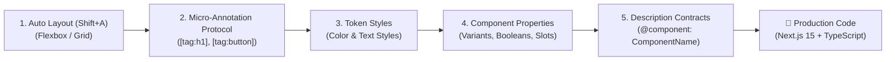

# Figma-for-AI Design System & Streamlining Guide

> **Target Audience:** UI/UX Designers & Design System Engineers  
> **Goal:** Structure Figma files to enable 100% deterministic, automated, production-ready Next.js/React code generation without manual translation friction.

---

## Executive Summary: The 5 Core Principles



---

## 1. Auto Layout Everywhere (The #1 Golden Rule)

AI code compilers translate Figma bounding boxes directly into **Flexbox (`display: flex`)** and **CSS Grid**. If Auto Layout is not used, the AI is forced to use absolute pixel positions (`top: 142px, left: 88px`), resulting in fragile, non-responsive code.

| Design Pattern | Avoid ❌ | Best Practice ✅ | Resulting Code |
| :--- | :--- | :--- | :--- |
| **Grouping Items** | `Ctrl+G` (Absolute Coordinates) | `Shift+A` (Auto Layout) | `flex flex-col gap-4` |
| **Buttons & Badges** | Rectangle shape with text on top | Frame with Fill + Padding | Responsive `<button>` that scales with content |
| **Card Rows & Grids** | Manually aligned cards | Auto Layout with **Fill container** / **Hug** | `grid grid-cols-1 md:grid-cols-4` |
| **Alignment** | Manual dragging | Set Alignment to Top-Left, Center, etc. | `items-center justify-between` |

---

## 2. Micro-Annotation Layer Naming Protocol

Designers do not need programming knowledge. When a specific HTML element, interactivity boundary, or text truncation rule is needed, prepend standard bracketed tags directly to the layer name:

$$\text{Syntax: } \mathbf{[tag:\langle elem\rangle][client:\langle bool\rangle][behavior:\langle rule\rangle]\ \text{LayerName}}$$

### Common Layer Tag Cheatsheet:

| Layer Name in Figma | Generated Code / HTML Semantics | Purpose / Benefit |
| :--- | :--- | :--- |
| `[tag:h1] Hero Main Title` | `<h1 className="text-5xl font-bold">...</h1>` | Guarantees semantic heading hierarchy without AI guessing. |
| `[tag:h2] Section Heading` | `<h2 className="text-3xl font-semibold">...</h2>` | Standardized subtitle styling. |
| `[tag:button][client:true] AddToCartBtn` | `<button onClick={...} className="...">` | Automatically marks interactive components with `"use client"`. |
| `[behavior:line-clamp-2] ProductDesc` | `<p className="line-clamp-2 text-sm text-gray-500">` | Multi-line text truncation without manual CSS tweaking. |
| `[tag:nav] HeaderNavBar` | `<nav aria-label="Main Navigation">` | Semantic navigation container. |
| `[tag:article] ProductCard` | `<article className="...">` | Accessible semantic article wrapper. |

---

## 3. Standardized Icon & Asset Naming

The asset extraction pipeline (`scripts/figma-asset-sync.mjs`) automatically scans, normalizes, and downloads assets based on prefix patterns:

### Vector Icons (`.svg`):
- Prefix vector layers with `icon/` or `ic-` (e.g. `icon/shopping-bag`, `icon/search`, `icon/heart`, `icon/filter`).
- **Why**: The sync engine replaces hardcoded fill colors with `fill="currentColor"`, allowing icons to dynamically adapt to text colors via Tailwind CSS.

### Raster Images (`.png` / `.webp`):
- Name image fill containers with descriptive names (e.g. `image/hero-banner`, `image/product-syltherine`).
- Set explicit Aspect Ratios on the frame (e.g., `aspect-[4/3]`, `aspect-square`).

---

## 4. Native Component Properties & Variants

Instead of duplicating frames to show different states, use native **Figma Component Properties** (Right Sidebar $\rightarrow$ Properties `+`):

```
┌─────────────────────────────────────────────────────────────┐
│ Figma Component Property  │ Generated TypeScript Code       │
├───────────────────────────┼─────────────────────────────────┤
│ Variant: size (sm/md/lg)  │ cva variant: size: { sm, md }   │
│ Variant: variant (solid)  │ cva variant: variant: { solid } │
│ Boolean: hasBadge (true)  │ JSX conditional: {hasBadge && } │
│ Text: title ("Syltherine")│ Dynamic prop: title: string     │
└─────────────────────────────────────────────────────────────┘
```

---

## 5. Structured YAML in Component Descriptions

When declaring a master component in Figma, add a structured YAML contract into the **Description** input (Right Sidebar $\rightarrow$ Description):

```yaml
@component: ProductCard
@as: article
@props:
  name: string
  categoryDesc: string
  price: string
  originalPrice: string?
  badge:
    text: string
    type: [discount, new]
  imageSrc: string
@slots:
  hoverActions: slot
```

**Why this matters**:
1. It feeds directly into `engine/registry/component-registry.json`.
2. The AI generator produces clean TypeScript interfaces matching this exact contract without prop hallucinations.

---

## 6. Design Tokens: Colors & Typography Styles

### Colors:
- Use Figma **Color Styles** (e.g., `Brand/Primary`, `Brand/Secondary`, `Surface/Muted`, `Text/Primary`) instead of unlinked hex codes (`#B88E2F`).
- Maps 1-to-1 with `src/styles/tokens.css` and Tailwind classes (`bg-primary`, `text-content-primary`).

### Typography:
- Use Figma **Text Styles** (e.g., `Heading/H1`, `Body/Medium`, `Label/Small`).
- The token auditor (`scripts/audit-tokens.mjs`) automatically maps font sizes and line heights to standard design tokens.

---

## Quick Reference Summary Table

```
┌──────────────────────────────┬────────────────────────────────────────────────────────┐
│ Requirement                  │ Designer Action in Figma                               │
├──────────────────────────────┼────────────────────────────────────────────────────────┤
│ Responsive Layout            │ Auto Layout (Shift+A) on all frames, cards, and rows   │
│ Semantic Headings            │ [tag:h1] Title, [tag:h2] Subtitle, [tag:h3] CardTitle   │
│ Interactive Hydration        │ [tag:button][client:true] ButtonName                   │
│ Text Truncation              │ [behavior:line-clamp-2] Description, [behavior:truncate│
│ Shared Icons                 │ icon/search, icon/cart, icon/user                      │
│ Component Contracts          │ Add YAML block in Master Component Description         │
│ Design Tokens                │ Link layers to Figma Color & Text Styles               │
└──────────────────────────────┴────────────────────────────────────────────────────────┘
```
