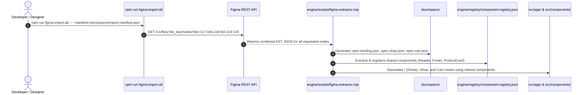

# Multi-Node & Multi-Page Extraction Guide

This guide shows how a user can import **multiple Figma frames, pages, or components in a single execution** using the Figma REST API and the toolchain.

---

## 1. How Multiple Node Extraction Works

In Figma, every canvas page and top-level screen frame has a unique **Node ID** (e.g. `117:346` for *Home*, `118:502` for *Shop*, `119:120` for *Cart*).

The Figma REST API endpoint supports comma-separated node IDs in a single HTTP request:
```http
GET https://api.figma.com/v1/files/{file_key}/nodes?ids=117:346,118:502,119:120
```

---

## 2. Extraction Input Formats (3 Flexible Ways)

### Method A: Single Command with Comma-Separated Node IDs
Pass multiple node IDs directly via CLI:
```bash
node engine/scripts/figma-extractor.mjs \
  --file="mP1jK3jXw" \
  --nodes="117:346,118:502,119:120"
```

---

### Method B: Extraction Manifest File (`docs/specs/import-manifest.json`)
Define an import manifest mapping each Figma Frame ID to a target Next.js page route:

```json
{
  "figmaFileKey": "mP1jK3jXw_furniro_design",
  "screens": [
    {
      "nodeId": "117:346",
      "name": "Landing Page",
      "targetRoute": "/",
      "targetPageFile": "src/app/page.tsx",
      "modulesDir": "src/components/modules/home"
    },
    {
      "nodeId": "118:502",
      "name": "Shop Catalog",
      "targetRoute": "/shop",
      "targetPageFile": "src/app/shop/page.tsx",
      "modulesDir": "src/components/modules/shop"
    },
    {
      "nodeId": "119:120",
      "name": "Shopping Cart",
      "targetRoute": "/cart",
      "targetPageFile": "src/app/cart/page.tsx",
      "modulesDir": "src/components/modules/cart"
    }
  ]
}
```

Then run the extraction pipeline with one command:
```bash
node engine/scripts/figma-extractor.mjs --manifest=docs/specs/import-manifest.json
```

---

### Method C: Full Canvas Auto-Discovery (`--all-frames`)
Automatically inspects the entire Figma canvas, finds all top-level `FRAME` nodes, and extracts them in a single run:

```bash
node engine/scripts/figma-extractor.mjs --file="mP1jK3jXw" --all-frames
```

---

## 3. Sample Multi-Node Extractor Script (`engine/scripts/figma-extractor.mjs`)

Below is the implementation that performs the multi-node batch fetch, extracts tokens, downloads shared assets with deduplication, and generates screen specs:

```javascript
// engine/scripts/figma-extractor.mjs
import fs from "fs";
import path from "path";

/**
 * Batch multi-node extraction runner
 */
async function extractMultipleNodes({ fileKey, nodeIds = [], manifestPath }) {
  const figmaToken = process.env.FIGMA_ACCESS_TOKEN;
  if (!figmaToken) {
    console.error("Error: FIGMA_ACCESS_TOKEN is required.");
    process.exit(1);
  }

  let nodesToFetch = nodeIds;
  let manifest = null;

  // 1. Read manifest if provided
  if (manifestPath && fs.existsSync(manifestPath)) {
    manifest = JSON.parse(fs.readFileSync(manifestPath, "utf-8"));
    fileKey = fileKey || manifest.figmaFileKey;
    nodesToFetch = manifest.screens.map((s) => s.nodeId);
  }

  console.log(`[Batch-Extractor] Fetching ${nodesToFetch.length} nodes from file: ${fileKey}`);
  console.log(`[Batch-Extractor] Node IDs: ${nodesToFetch.join(", ")}`);

  // 2. Single Batch API Request
  const idsQuery = nodesToFetch.join(",");
  const url = `https://api.figma.com/v1/files/${fileKey}/nodes?ids=${idsQuery}`;

  const res = await fetch(url, {
    headers: { "X-Figma-Token": figmaToken },
  });

  if (!res.ok) {
    throw new Error(`Figma API Error ${res.status}: ${res.statusText}`);
  }

  const data = await res.json();
  const nodes = data.nodes; // Dictionary: { "117:346": { document: ... }, "118:502": { ... } }

  // 3. Process Each Screen Node
  for (const nodeId of nodesToFetch) {
    const nodeData = nodes[nodeId];
    if (!nodeData) {
      console.warn(`[Batch-Extractor] Node ${nodeId} not found in response.`);
      continue;
    }

    const screenName = nodeData.document.name.toLowerCase().replace(/[^a-z0-9]+/g, "-");
    const specOutPath = path.join(process.cwd(), "docs", "specs", `spec-${screenName}.json`);

    // Write individual screen specification
    fs.mkdirSync(path.dirname(specOutPath), { recursive: true });
    fs.writeFileSync(specOutPath, JSON.stringify(nodeData.document, null, 2));

    console.log(`✅ Extracted: [${nodeId}] "${nodeData.document.name}" -> ${specOutPath}`);
  }

  console.log("\n[Batch-Extractor] Batch extraction completed successfully!");
}

// Example CLI entry
const args = process.argv.slice(2);
const fileArg = args.find((a) => a.startsWith("--file="))?.split("=")[1];
const nodesArg = args.find((a) => a.startsWith("--nodes="))?.split("=")[1]?.split(",");
const manifestArg = args.find((a) => a.startsWith("--manifest="))?.split("=")[1];

if (fileArg || manifestArg) {
  extractMultipleNodes({ fileKey: fileArg, nodeIds: nodesArg, manifestPath: manifestArg });
}
```

---

## 4. End-to-End User Execution Flow



---

## 5. Benefits of the Single-Go Multi-Node Import

1. **1 Single API Call:** Pulls all requested pages in one HTTP request, saving API rate limits.
2. **Instant Asset Deduplication:** Downloads shared assets (e.g. logos, common button icons) once across all pages.
3. **Automatic Route Generation:** Automatically maps each Figma frame to its target route (`/`, `/shop`, `/cart`).
